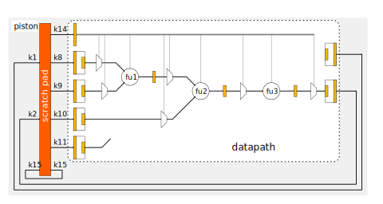
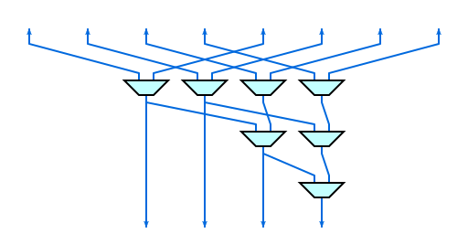
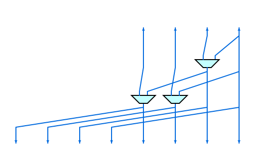

## Complex Multiplication

### Stage 1
K8 Funnel (CFG: 2:1)
K9 Funnel (CFG: 2:1)

### Stage 2
16x complex multiplications K8[i] C* k9[i]    (Re:18,Im:18) C* (Re:18,Im:18) => (Re:36,Im:36)

### Stage 3
Bypass
16x(Re:36,Im:36) => 16x(Re:36,Im:36)

### Stage 4
16x burrel-shifter (BS)(CFG:shift)
(Re:36,Im:36) => (Re:16,Im:16)

### Stage 5
K1 DeFunnel (CFG: 1:2)

## FFT Radix4 (DIT)

### Stage 1
K8 Funnel (CFG: 2:1)
K9 Funnel (CFG: 2:1)

### Stage 2
16x complex multiplications K8[i] C* k9[i]     (Re:18,Im:18) C* (Re:18,Im:18) => (Re:36,Im:36)

### Stage 3
4x Radix4 (CFG: Radix4)
4x(Re:36,Im:36) => 4x(Re:36,Im:36)

### Stage 4
16x burrel-shifter (BS)(CFG:shift)
(Re:36,Im:36) => (Re:16,Im:16)

### Stage 5
K1 DeFunnel (CFG: 1:2)

# Data Formats

  * 32-bit location in memory = x[31:16] = Imaginary (signed); x[15:0] = Real (signed)
  * s18 - signed value (internal to datapath)
  * s36 - signed value (internal to datapath)

# Data Path operations

## funnel

  * 32 inputs
  * reduction factor modes
    - 2:1
    - 4:1
    - 8:1

## defunnel

## bs - burrel-shifter

  * shift
  * rounding
  * saturation

## mul - signed multiplication

## add - addition

## sub - subtraction
